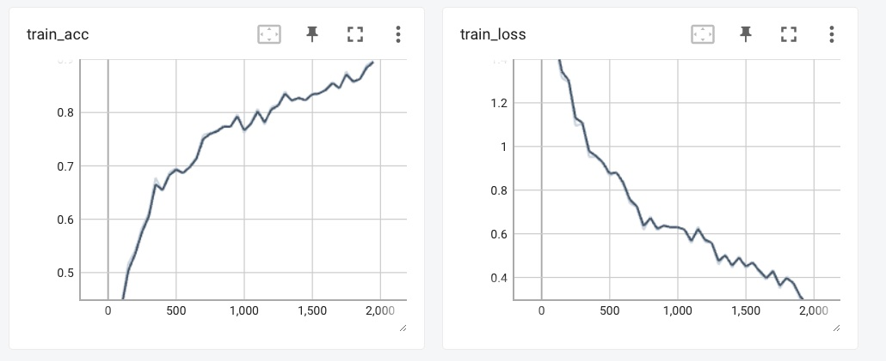
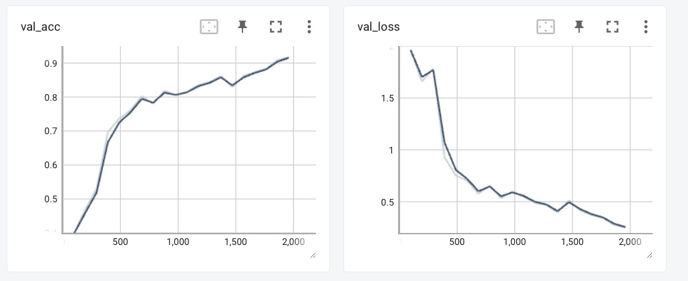
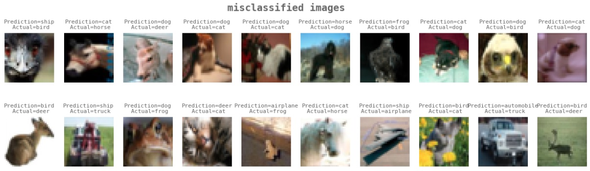

# PyTorch Lightning based model training

- Use One Cycle policy for learning rate scheduling
- Identfies the max_lr using lr_finder
- Albumentation image augmentation
  - cut out
  - random crop
- Tensorboard logging

## Performance curve
Achieves 91.53% test accuracy

### Sample 10 misclassified images

### Gradio interface for model inference

[Link to HuggingFace spaces app](https://huggingface.co/spaces/venkat-natchi/resnet18_cifar10)
