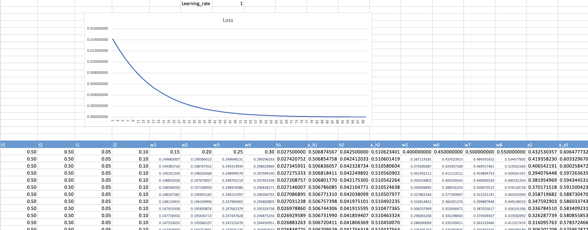

# Part 1

Excel based back propogation calculation for a regression task. 



Learning rate can be varied and it's impact on the loss can be visualized.

### Hidden Layer
$$h_1 = w_1 * i_1 + w_2 * i_2$$
$$h_2 = w_3 * i_1 + w_4 * i_2$$
where $i_1$ and $i_2$ represents the input values
Applying activation function (sigmoid) on the hidden values ($h$)
$$ a_{h_1} = \sigma{(h_1)}  = \frac{1}{1 + e^{-h_1}}$$
similarly,
$$ a_{h_2} = \sigma{(h_2)} $$

### Output Layer
$$ o_1 = w_5 * h_1 + w_6 * a_{h_2}$$
$$ o_2 = w_7 * h_1 + w_8 * a_{h_2}$$
Applying activation function (sigmoid) on the outputs ($o$)
$$ a_{o_1} = \sigma{(o_1)} $$
$$ a_{o_2} = \sigma{(o_2)} $$

### Error/ loss values

$$ E_{total} = E_1+ E_2 $$
$$ E_1 = \frac{1}{2} * (t_1 - a_{o_1})^2 $$ 
$$ E_2 = \frac{1}{2} * (t_2 - a_{o_2})^2 $$ 
where $t_1$ and $t_2$ represents the target values

## Dervatives for output layer
$$\frac{\partial E_{total}}{\partial w_5} = \frac{\partial (E_1 + E_2)}{ \partial w_5}$$
$$\frac{\partial E_{total}}{\partial w_5} = \frac{\partial (E_1)}{\partial w_5} = \frac{\partial (E_1)}{\partial a_{o_1}}  * \frac{\partial a_{o_1}}{\partial o_1} * \frac{\partial o_1}{\partial w_5} $$

where, 

$$\frac{\partial E_1}{\partial a_{o_1}} = \frac{\partial (\frac{1}{2} * (t_1 - a_{o_1})^2)}{\partial a_{o_1}} = (a_{o_1} - t_1)$$
$$\frac{\partial a_{o_1}}{\partial o_1} = \frac{\partial (\sigma(o_1))}{\partial o_1} = a_{o_1} *( 1 - a_{o_1})$$
$$\frac{\partial o_1}{\partial w_5}  =  a_{h_1}$$
Hence, 
$$\frac{\partial E_{total}}{\partial w_5} = (a_{o_1} - t_1) * a_{o_1} *( 1 - a_{o_1}) * a_{h_1} $$
$$\frac{\partial E_{total}}{\partial w_6} = (a_{o_1} - t_1) * a_{o_1} *( 1 - a_{o_1}) * a_{h_2} $$
$$\frac{\partial E_{total}}{\partial w_7} = (a_{o_2} - t_2) * a_{o_2} *( 1 - a_{o_2}) * a_{h_1} $$
$$\frac{\partial E_{total}}{\partial w_8} = (a_{o_2} - t_2) * a_{o_2} *( 1 - a_{o_2}) * a_{h_2} $$


### Derivatives for hidden layers


$$\frac{\partial E_{total}}{\partial w_1} = \frac{\partial (E_{total})}{ \partial a_{h_1}} * \frac{\partial a_{h_1}}{\partial h_1} * \frac{\partial h_1}{\partial w_1}$$

where,
$$\frac{\partial E_{total}}{\partial a_{h_1}} = \frac{\partial (E_1 + E_2)}{ \partial a_{h_1}}$$
$$ \frac{\partial E_1} {\partial a_{h_1}} =  (a_{o_1} - t_1) * a_{o_1} * (1 - a_{o_1}) * w_5 $$
$$ \frac{\partial E_2} {\partial a_{h_1}} =  (a_{o_2} - t_2) * a_{o_2} * (1 - a_{o_2}) * w_7 $$
$$ \frac{\partial E_{total}} {\partial a_{h_1}} =    (a_{o_1} - t_1) * a_{o_1} * (1 - a_{o_1}) * w_5  + (a_{o_2} - t_2) * a_{o_2} * (1 - a_{o_2}) * w_7$$
$$ \frac{\partial E_{total}} {\partial a_{h_2}} =  (a_{o_1} - t_1) * a_{o_1} * (1 - a_{o_1}) * w_6  + (a_{o_2} - t_2) * a_{o_2} * (1 - a_{o_2}) * w_8$$

$$\frac{\partial E_{total}}{\partial w_1} = (a_{o_1} - t_1) * a_{o_1} *( 1 - a_{o_1}) * w_5 + (a_{o_2} - t_2) * a_{o_2} * (1 - a_{o_2}) * w_7 * a_{h_1} * (1 - a_{h_1}) * i_1 $$
$$\frac{\partial E_{total}}{\partial w_2} = (a_{o_1} - t_1) * a_{o_1} *( 1 - a_{o_1}) * w_5 + (a_{o_2} - t_2) * a_{o_2} * (1 - a_{o_2}) * w_7 * a_{h_1} * (1 - a_{h_1}) * i_2 $$
$$\frac{\partial E_{total}}{\partial w_3} = (a_{o_1} - t_1) * a_{o_1} *( 1 - a_{o_1}) * w_6 + (a_{o_2} - t_2) * a_{o_2} * (1 - a_{o_2}) * w_8 * a_{h_2} * (1 - a_{h_2}) * i_1 $$
$$\frac{\partial E_{total}}{\partial w_4} = (a_{o_1} - t_1) * a_{o_1} *( 1 - a_{o_1}) * w_6 + (a_{o_2} - t_2) * a_{o_2} * (1 - a_{o_2}) * w_8 * a_{h_2} * (1 - a_{h_2}) * i_2 $$

# Part 2

> `run.ipynb` has the script to execute the entire workflow.

## `model.py` 

-  Model definition and function to train and evaluate the model. 
-  Model summary:
```
----------------------------------------------------------------
        Layer (type)               Output Shape         Param #
================================================================
            Conv2d-1           [-1, 32, 28, 28]             320
              ReLU-2           [-1, 32, 28, 28]               0
       BatchNorm2d-3           [-1, 32, 28, 28]              64
            Conv2d-4           [-1, 16, 28, 28]           4,624
              ReLU-5           [-1, 16, 28, 28]               0
       BatchNorm2d-6           [-1, 16, 28, 28]              32
         MaxPool2d-7           [-1, 16, 14, 14]               0
           Dropout-8           [-1, 16, 14, 14]               0
            Conv2d-9           [-1, 16, 16, 16]             272
             ReLU-10           [-1, 16, 16, 16]               0
      BatchNorm2d-11           [-1, 16, 16, 16]              32
           Conv2d-12           [-1, 32, 16, 16]           4,640
             ReLU-13           [-1, 32, 16, 16]               0
      BatchNorm2d-14           [-1, 32, 16, 16]              64
           Conv2d-15             [-1, 16, 8, 8]           4,624
             ReLU-16             [-1, 16, 8, 8]               0
      BatchNorm2d-17             [-1, 16, 8, 8]              32
        MaxPool2d-18             [-1, 16, 4, 4]               0
          Dropout-19             [-1, 16, 4, 4]               0
           Conv2d-20            [-1, 128, 4, 4]           2,176
             ReLU-21            [-1, 128, 4, 4]               0
      BatchNorm2d-22            [-1, 128, 4, 4]             256
        MaxPool2d-23            [-1, 128, 2, 2]               0
          Dropout-24            [-1, 128, 2, 2]               0
        AvgPool2d-25            [-1, 128, 1, 1]               0
           Linear-26                   [-1, 10]           1,290
================================================================
Total params: 18,426
Trainable params: 18,426
Non-trainable params: 0
----------------------------------------------------------------
Input size (MB): 0.00
Forward/backward pass size (MB): 1.27
Params size (MB): 0.07
Estimated Total Size (MB): 1.35
----------------------------------------------------------------
```

## `utils.py`

- contain functions to download and prepare the MNIST dataset.