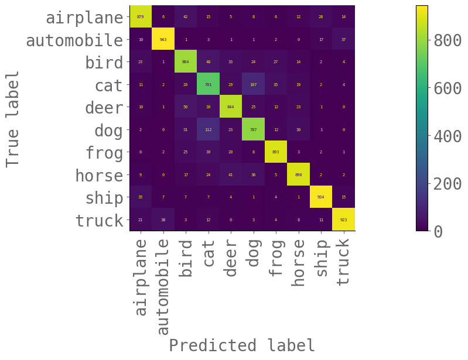

# CIFAR 10
Building a CIFAR 10 classifier models using convolutional neural networks with advanced regularization techniques

## `data_loader.py`
- Custom CIFAR 10 dataset loader based on Albumentation (data augmentation) pipeline. 
  - horizontal flip with 50% propability
  - shiftScaleRotate with 30% propability
  - cutout based on coarseDropout augmentation; 
    - height - (8, 16) 
    - width - (8, 16)
    - p=0.3
  - OneOf with 30% probability
    - RandomBrightnessContrast
    - HueSaturationValue

## `Model.py`
- Four convolutional block deep learning architecture.
- Each standard conv layer consists of Conv2d, ReLU activation, Batch Normalization and Dropout layer.
- Use dilated convolution in C2 and C4 blocks
- DepthwiseSeparable convolution in C3 and C4 blocks

## `solution.py`
- use `ReduceLRonPlateau` method for learning rate scheduling
- give the samples augmented images
- Building the models with following number of channels in each layer and dropout as 2%
  ```
   [
    32, 32, 32, 64, 
    16, 64, 32, 64, 
    16, 64, 32, 64, 
    16, 64, 32, 128, 
    128, 10
  ]
  ```
- Model contains 180,400 number of parameters
- Model achieves 85% test accuracy in $36^{th}$ epoch
- At the end of 42 epoches, the model achieves 85.98% test accuracy
- plots some of the misclassified images with predicted and target labels values over it.

## `metrics.py`
- calculates the every class test accuracy
- displays confusion matrix 

